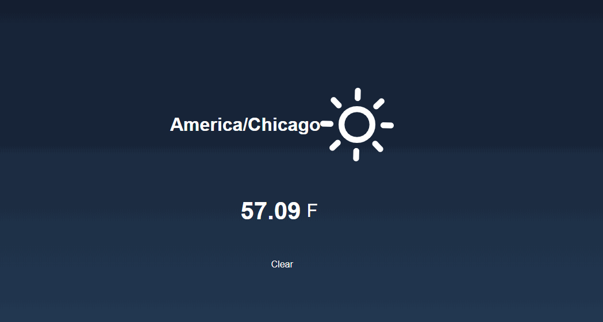

# Sky-s-Condition
Resources: HTML, CSS, JavaScript, dark sky API: https://www.darksky.net, Visual Studio Code Real world weather app utilizing “dark sky API” to pull all the necessary weather information needed. Dark sky is free for up to 1000 API calls. Testable on my portfolio.

📝 `NOTE:` Below is the App Walkthrough
### App Walk-through

- [x] Reveals weather information in user's location using geolocation
- [x] Add a view for the front side of the web app to display the weather
- [x] Build in logic to show the celsius temperature when the fahrenheit temperature is clicked
- [x] Push code to GitHub
